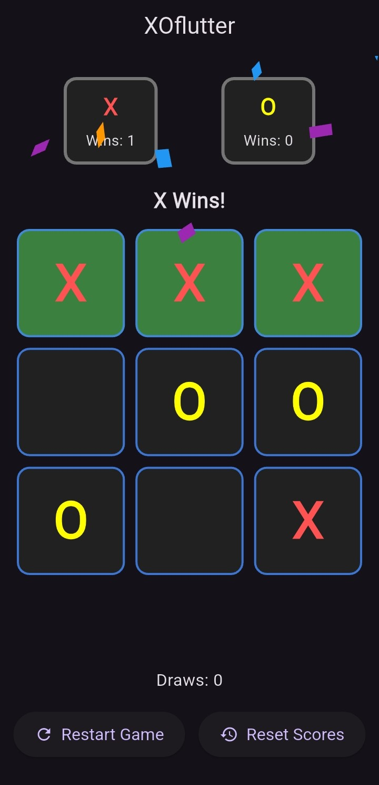
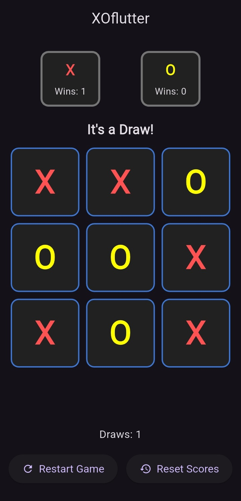

# XOFlutter :video_game:

A clean and modern **Tic-Tac-Toe (XO)** game built with **Flutter** for Android & iOS.  
Two players can play on the same device, track scores, and celebrate wins with animations.  

---

## :sparkles: Features
- :dart: 3x3 Tic-Tac-Toe grid  
- :busts_in_silhouette: Two-player mode (same device)  
- :arrows_counterclockwise: Restart button (reset board)  
- :wastebasket: Reset scores button  
- :trophy: Score counter (X, O, and Draws)  
- :tada: Confetti animation when someone wins  
- :star2: Player turn highlight  

---

## :camera_with_flash: Screenshots

<p align="center">
  
  
  
</p>

---

## :movie_camera: Demo
<p align="center">
  <video src="screenshots/demo.mp4" width="300" controls></video>
</p>

---

## :rocket: Getting Started

```bash
# Clone the repo
git clone https://github.com/Deepanshu-Singh-Rathore/XOFlutter.git
cd XOFlutter

# Install dependencies
flutter pub get

# Run the app
flutter run
