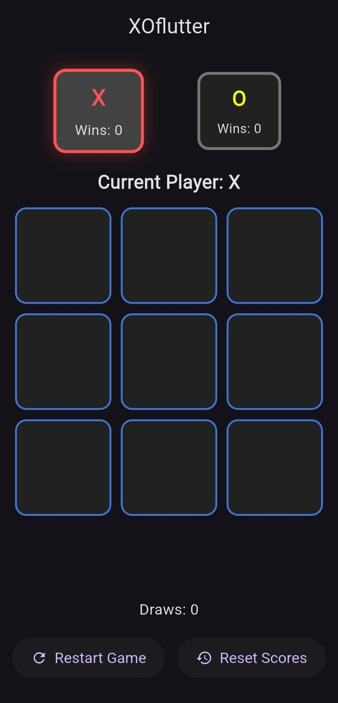

# XOFlutter 🎮

A clean and modern **Tic-Tac-Toe (XO)** game built with **Flutter** for Android & iOS.  
Two players can play on the same device, track scores, and celebrate wins with animations.  

---

## ✨ Features
- 🎯 3x3 Tic-Tac-Toe grid  
- 👥 Two-player mode (same device)  
- 🔄 Restart button (reset board)  
- 🗑️ Reset scores button  
- 🏆 Score counter (X, O, and Draws)  
- 🎉 Confetti animation when someone wins  
- 🌟 Player turn highlight  

---

## 📸 Screenshots

<p align="center">
  
  
  
</p>

---

## 🎥 Demo

<p align="center">
  <video width="300" height="auto" controls>
    <source src="screenshots/demo.mp4" type="video/mp4">
    Your browser does not support the video tag.
  </video>
</p>

---

## 🚀 Getting Started

```bash
# Clone the repo
git clone https://github.com/your-username/XOFlutter.git
cd XOFlutter

# Install dependencies
flutter pub get

# Run the app
flutter run
